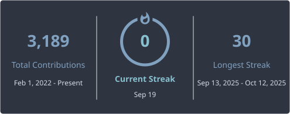

 
# Hi, I'm Mahmoud Medhat 👋

Flutter engineer. I ship production iOS and Android apps — marketplaces, delivery, healthcare — and own the work from unclear requirements through store release.

[Email](mailto:mahmoudmdhat852@gmail.com) · [LinkedIn](https://www.linkedin.com/in/mahmoud-medhat-8a4200128) · Remote / relocation

## What I work on

3+ years as a Flutter developer. Clean Architecture, BLoC / Riverpod, payments, maps, Firebase, real-time updates, Play Store and App Store releases.

Right now: **YouVision** (Warda, Matlop) and **UD-Tech** part-time (UDH, Alter, MLM, Codency).

## Featured apps

**Matlop** — Built a home-service booking app with location-based technician matching, payments, and search/filtering across packages.
[Google Play](https://play.google.com/store/apps/details?id=com.matlop.service) · [App Store]([https://apps.apple.com/eg/app/takka/id6502396946](https://apps.apple.com/sa/app/matlop-%D9%85%D8%B7%D9%84%D9%88%D8%A8/id6747580868))

**Takkeh** — delivery with live maps and in-app chat. 10K+ downloads in the first year.  
[Google Play](https://play.google.com/store/apps/details?id=com.mah852.takha) · [App Store](https://apps.apple.com/eg/app/takka/id6502396946)

**ASL** — real estate marketplace (apartments, offices, land, farms, factories). Independent project.  
[Google Play](https://play.google.com/store/apps/details?id=com.asl.user) · [App Store](https://apps.apple.com/us/app/asl-%D8%A3%D8%B5%D9%84/id6791681109)

**UDH** — patient app: appointments, doctors, clinic branches, medical files. Built end-to-end.  
[Google Play](https://play.google.com/store/apps/details?id=com.mah852.myclinic) · [App Store](https://apps.apple.com/eg/app/udh/id6747332204)

**Warda** — multi-vendor flowers: pickup/delivery, bouquet builder, merchant dashboard.  
[Google Play](https://play.google.com/store/apps/details?id=com.you.wardh) · [App Store](https://apps.apple.com/eg/app/wardh-%D9%88%D8%B1%D8%AF%D9%87/id6751801816)

**Codency** — hospital alerts: doctors notify colleagues within 1 km via alarm-style push.  
[Google Play](https://play.google.com/store/apps/details?id=com.udtech.codency) · [App Store](https://apps.apple.com/eg/app/codency-%D9%83%D9%88%D8%AF%D9%86%D8%B3%D9%8A/id6740293964)

**Dobzz** — merchant dashboard: orders, staff assignment, live delivery, catalog, chat, analytics.  
[Google Play](https://play.google.com/store/apps/details?id=com.mah852.dobbz) · [App Store](https://apps.apple.com/eg/app/dobzz-system-%D8%AF%D9%88%D8%A8%D8%B2/id6745785966)

**Ala Qdk** — two-sided food delivery (customer + seller). Payments, live order tracking, seller dashboard for 200+ vendors. Checkout time down 30%.  
[Google Play](https://play.google.com/store/apps/details?id=com.codgoo.alaaqadik) · [App Store](https://apps.apple.com/eg/app/ala-qdk-%D8%B9%D9%84%D9%89-%D9%82%D8%AF%D9%83/id6743190244) · Seller: [Play](https://play.google.com/store/apps/details?id=com.codgoo.seller_alaa_qadik) · [App Store](https://apps.apple.com/eg/app/ala-qdk-seller-%D8%B9%D9%84%D9%89-%D9%82%D8%AF%D9%83/id6743190165)

Also on both stores: **Matlop**, **Cleaning World**. Alter and MLM are pending release.

## Experience

- **YouVision Technologies** — Flutter Developer (Jan 2025 – Present) · Warda, Matlop
- **UD-Tech** — Flutter Developer, part-time (Nov 2024 – Present) · UDH, Alter, MLM, Codency
- **Codgoo** — Flutter Developer (Dec 2023 – Jan 2025) · Ala Qdk, Dobzz
- **Freelance** — independent projects · Takkeh, Cleaning World, ASL

## Stack

Flutter · Dart · BLoC (Cubit) · Riverpod · Provider · GetX · Clean Architecture · MVVM · Firebase · REST · Hive · Sqflite · Stripe · Paymob · PayPal · PayTabs · Lahza · CI/CD · Git

Kotlin and Swift when a native piece is required.

## GitHub Streak
 

